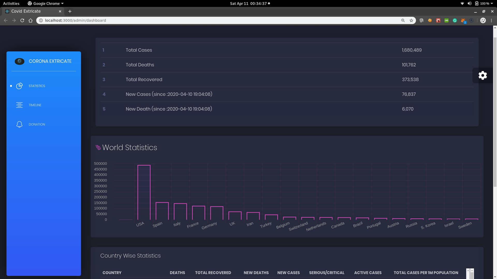
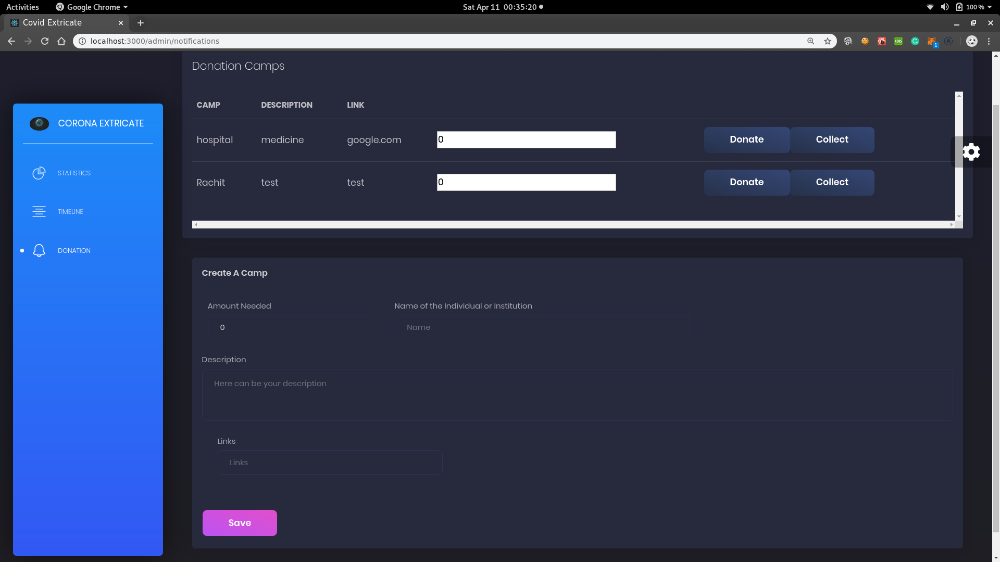

#                                              Covid-Extricate
####                                 A decentralized solution to Covid19


## Live Demo


##  Installation
```
1. Clone the Repository.
2. npm i
   - npm start

```  
## About This Project
This project aims to ease the day-to-day life of people, doctors, institutions, 
1. All latest updates regarding the pandemic in one place.
2. Need for money? Raise a **Donation camp**.
3. Doctor? Get information in one place and also spread necessary information.

## Technology Used
* ReactJS
* NodeJS
* GraphQL
* Solidity Smart Contracts
* Web3

## Screenshots

* Get live statistics about corona virus.




* Get timeline of a particular country tot observe the spread rate.


* Need of money due to the pandamic? Create a donation camp describing your need and providing links to required  documents to proov the docs legit.


